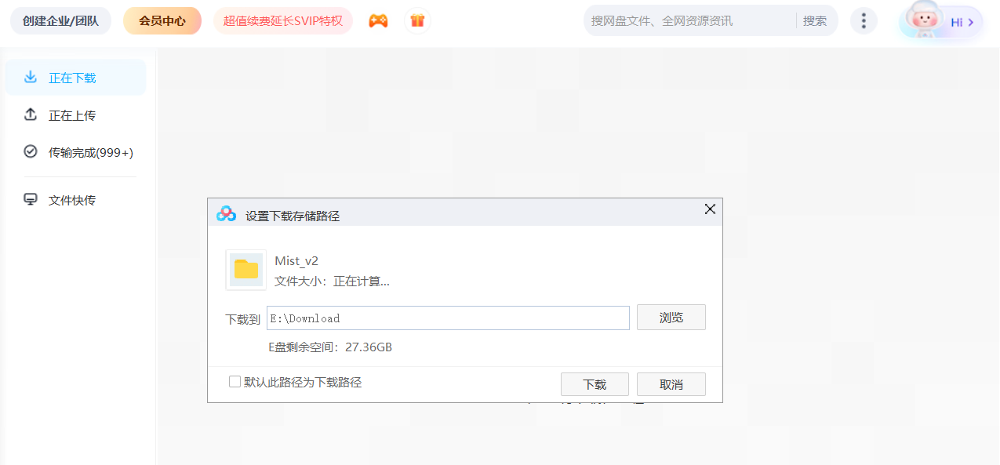
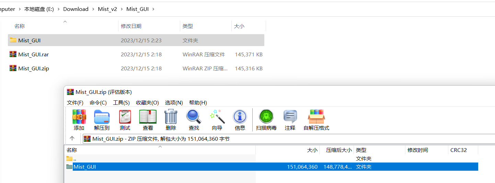
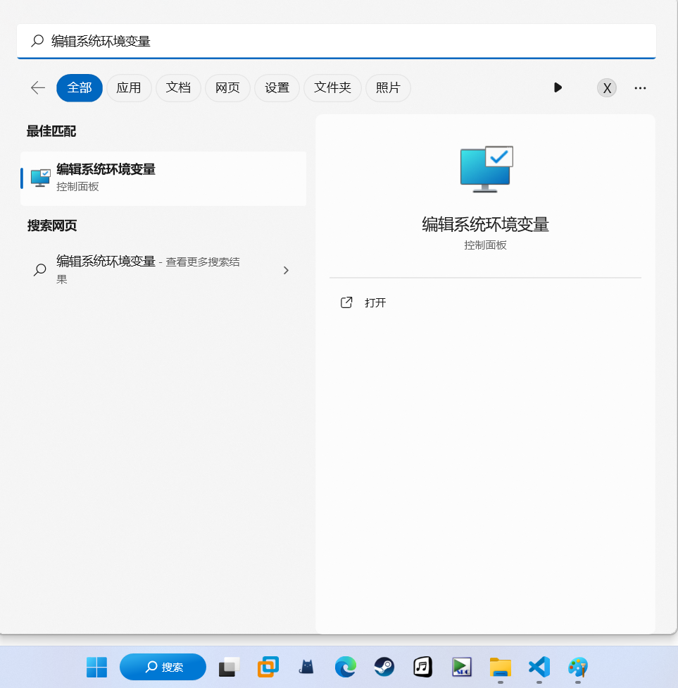
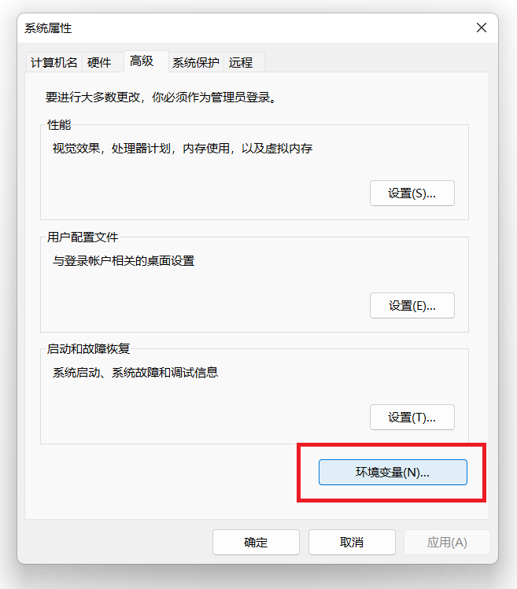
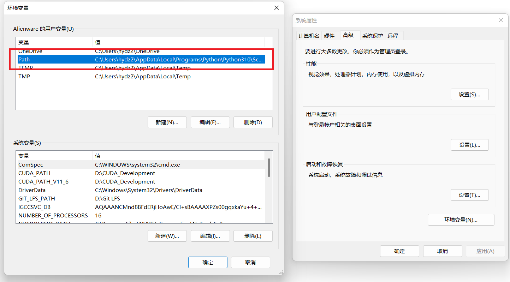
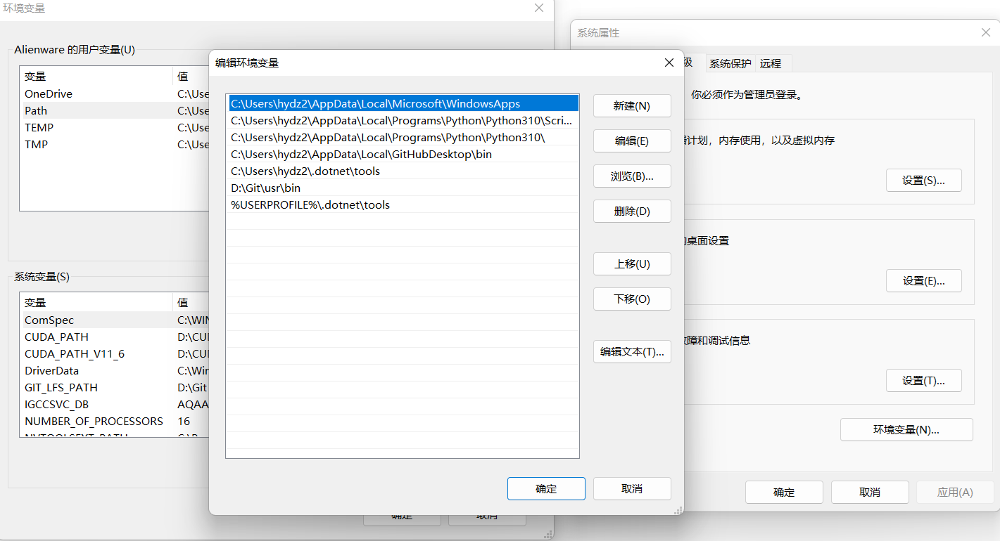
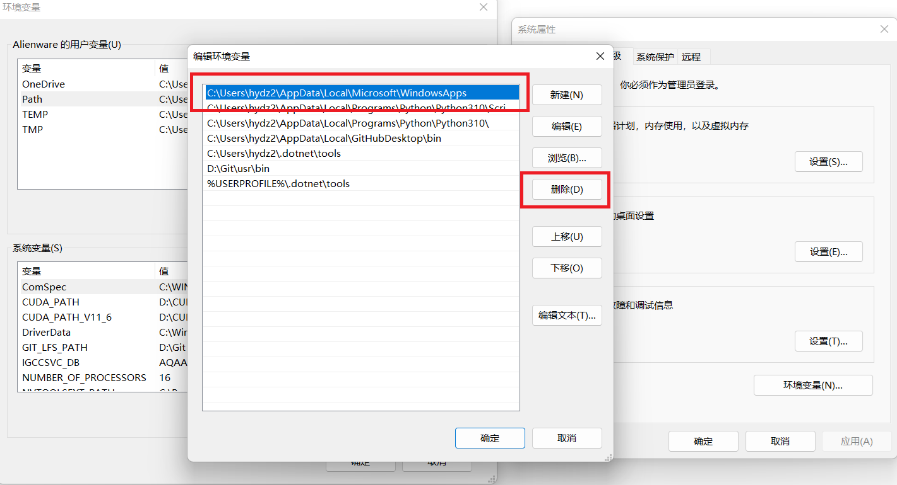
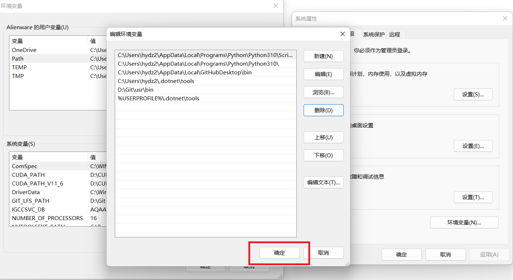
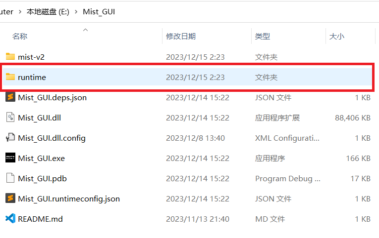

# MistV2简明使用教程

本教程面向MistV2的非开发者用户，包括画手和其他使用MistV2对图片添加水印的个人。开发者用户请访问我们的项目代码仓库并按照代码仓库README文件提供的教程运行。

## 目录

[安装](##安装)

[使用](##使用)

[常见问题](##常见问题)


## 安装

步骤一：清除计算机中关于Microsoft应用商店的环境变量

点击开始菜单，并在搜索栏搜索并单击“编辑系统环境变量”


单击后出现以下界面，然后点击“环境变量”：


进入到这个界面，然后双击上方界面的"Path"这一栏：



然后如果列表中含有`C:\Users\xxx(你的用户名)\AppData\Local\Microsoft\WindowsApps`这一项，直接删除即可。


步骤二：安装`Mist_GUI`运行所需的动态库

在整合包中已经包含了`Mist_GUI`运行所需的动态库，在`runtime`文件夹内：


点击`windowsdesktop-runtime-7.0.13-win-x64.exe`进行安装即可。


步骤三：运行`Mist_GUI.exe`

双击项目里的`Mist_GUI.exe`：


然后会弹出以下界面：


步骤四：安装3.10.11版本的python

先去卸载电脑里原有的python（如果有的话），然后点击`Install Python 3.10.11`按钮，会自动弹出python的安装页面，记得勾选`Add Python 3.10 to PATH`，之后点击`Install Now`安装即可：



安装之后记得重启电脑，使得环境变量配置生效。

步骤五：安装Git

点击`Install Git`按钮安装Git即可，Git的安装均按照默认配置。


步骤六：如果是中国用户，则可以选择对pip换源，使得下载依赖包的速度更快

如果要选择换源，点击`Change Source`按钮即可，如果要换回默认的源，点击`Reset Source`按钮即可。


步骤七：准备Pytorch的环境配置

点击`Prepare Environment`按钮，即可进行Pytorch的环境配置。



如果要进行环境测试，点击`Test Environment`按钮即可。

如果出现`Cuda is available: True`的情况，说明该机器是N卡，并且可以使用Cuda进行推理加速。



如果要清除已经配置好的环境，点击`Clear Environment`按钮即可。

步骤八：运行Mist_Webui

完成环境配置之后，点击`Run Mist`即可运行Mist_Webui。



之后使用任意一个浏览器，在地址栏输入`http://127.0.0.1:7860`即可使用Mist_Webui。



步骤九：准备要打上水印的图片，并使用Webui配置和运行Mist

要打上水印的图片默认放在`src/data/training`文件夹，直接把要打上水印的图片放置在该文件夹即可。（示例图已经过原画师授权）



然后按照以下的参数填写：

| 参数 | 值 |
| :-: | :-: |
| Data Path | data/training |
| Output Path | output |
| Target Model Path | stable-diffusion/stable-diffusion-1-5 |
| Prompt | （按照个人喜好填写即可，这里的例子为masterpiece, best quality） |



Strength则代表水印强度和处理步数，数值越高，对ai生成模型的防御功能越强，但对原图像的影响也越大，画师可以根据实际需求进行调整。

对于Device这一项，如果你的电脑是N卡且显存大于等于6GB，则可以使用`gpu`这一项，大大加快处理水印的速度（以RTX 3060为例，Steps=5时，大约1小时5张图），否则使用`cpu`这一项，对显存没有限制但是处理水印的速度相应慢很多（Steps=5时，大约1.5小时处理1张图）。

对于Precision这一项，可以先保持默认选项`bfloat16`，鉴于部分用户的显卡不支持`bfloat16`运算，如果出现报错了切换到`float16`选项即可。

之后点击Webui内的`Mist`这个按钮即可，出现以下信息说明处理成功：



被打上水印的图片放在`src/output`这个文件夹：


## 使用

Mist WebUI的使用界面如下图所示：


**（重要）如何选择一次运行Mist添加水印的图片**：选择画风、内容具有一致性的5-10张图片一同添加水印为宜，一次添加水印的总图片数切忌超过15张。

**（重要）MistV2 GPU版本运行要求**：30系及之后发布的Nvidia显卡，显存6G以上

WebUI含有两部分参数：常用参数和专业参数。前者为使用MistV2必须填写的参数，后者则对控制MistV2性能的起不同的作用。下面分表介绍两组参数。

**常用参数**：

| 参数名                  | 说明                                                                               | 如何填写                                                | 参数名                  |
| -------------------------- | ------------------------------------------------------------------------------------ | ----------------------------------------------------------- | -------------------------- |
| Strength（强度）       | 噪声的强度，越大保护效果越好。                                        | 换不同强度看看噪声效果，选择自己能接受的最大强度 | Strength（强度）       |
| Device（设备）         | 运行Mist的计算设备。GPU运行速度显著快于CPU。不懂显卡显存可以通过百度查显卡名字查到。 | 有6G显存以上显卡选GPU，其他情况选CPU          | Device（设备）         |
| Resizing（尺寸）       | 是否输出和原图相同尺寸的加噪图                                        | 保留默认值即可                                       | Resizing（尺寸）       |
| Mode（模式）           | 加水印的方法。Mode1针对色彩画，Mode3针对白描或二次元。Mode2加强了图生图防御。 | 二次元图选Mode3，其他选Mode1，特别在意防图生图效果可选Mode2 | Mode（模式）           |
| Data Path（数据路径） | 计算机上存放待加水印图片的位置                                        | 待加噪图片所在的路径                              | Data Path（数据路径） |
| Output Path（输出路径） | 输出水印图的位置                                                             | 找个空的文件夹即可                                 | Output Path（输出路径） |
| Model Path（模型路径） | 从我们提供的地址中下载模型压缩包并且直接解压到一个空的文件夹，即为该文件夹的地址 | 按说明填写                                             | Model Path（模型路径） |
| Class Path（对比数据路径） | 存放对比数据的位置                                                          | 使用一个空的文件夹即可                           | Class Path（对比数据路径） |
| Prompt（提示词）      | 概括待加水印图片的提示词                                                 | 概括图片的风格、内容，用逗号分割不同的短句 | Prompt（提示词）      |


**专业参数**：

| 参数名                                                    | 说明                                                                                               | 如何填写                                             |
| ------------------------------------------------------------ | ---------------------------------------------------------------------------------------------------- | -------------------------------------------------------- |
| Class Prompt（对比数据提示词）                      | 用于生成对比数据的提示词                                                                 | 保持和提示词一致即可                           |
| Training epochs of Mist-V2（攻击训练步数）           | 总攻击轮数；越大的轮数对多步LoRA的针对性越强，但也越容易跑偏，同时图生图效果会减弱 | 非研究用途保持默认值即可                     |
| Training steps of LoRA in one epoch（单轮LoRA训练步数） | 一轮攻击中目标模型的训练步数；越多的步数对多步LoRA的针对性越强，但也越容易跑偏，同时图生图效果会减弱 | 非研究用途保持默认值即可                     |
| Training steps of attacking in one epoch（单轮攻击训练步数） | 一轮攻击中攻击的训练步数；越多步数攻击效果越好，但运行时间也会相应增加 | 可以调大到自己可接受的最大值               |
| The learning rate of LoRA                                    | 靶点LoRA学习率                                                                                  | 非研究用途保持默认值即可；也可尝试调到LoRA训练最常用的值 |
| The learning rate of PGD（攻击步长）                   | 攻击学习率                                                                                      | 非研究用途保持默认值即可                     |
| The weight of prior loss（对比数据影响因子）       | 对比数据在攻击中的影响                                                                    | 非研究用途保持默认值即可                     |
| The weight of vae loss（Mode 2影响因子）               | 仅在启动Mode 2后有效，因子越大，防图生图效果越强，相应的其他性能会有一定损失 | 按个人需求调整，不要改变因子的数量级   |
| LoRA Ranks                                                   | 靶点LoRA阶数                                                                                     | 非研究用途保持默认值即可；也可尝试调到LoRA训练最常用的值 |


## 常见问题

Q: 点击相关按钮运行不了，并遇到打开Microsoft应用商店的情况怎么办？

A: 解决方法参见步骤1。

Q: 程序运行时出现以下报错信息，是否会影响使用？

```txt
A matching Triton is not available, some optimizations will not be enabled.
Error caught was: No module named 'triton'
```

A: 这个是由于`xformers`库安装在Windows环境下导致的，直接忽略即可，不会影响Mist的使用。

Q: 如果配置环境过程中出现`No space left on device`怎么办？

A: 这个是由于C盘剩余空间太小导致的，给C盘清理出足够多的空间（大约5GB以上）即可。

Q: 如果点击完`Install Python 3.10.11`按钮再点击`Prepare Environment`按钮出现`Couldn't launch python`错误怎么办？

A: 这是安装完python之后环境变量没有更新导致的，重启电脑再运行`Mist_GUI`即可。